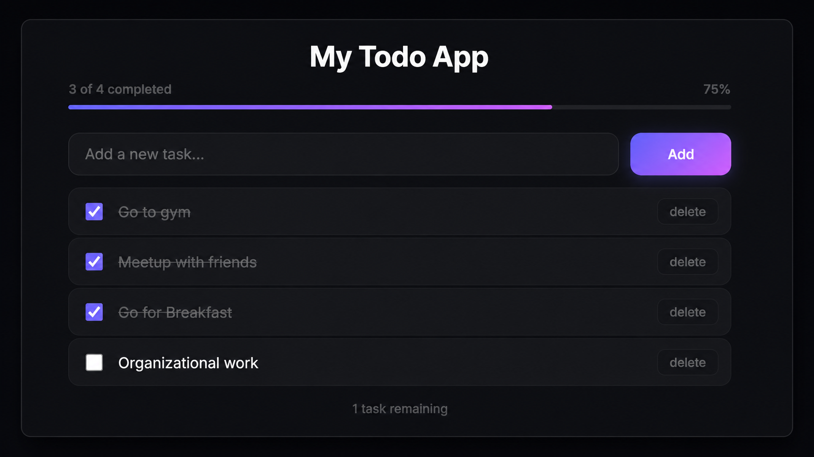

#  TaskTracker

A lightweight task management application that helps users to organize daily tasks with a clean interface and stores data locally, so tasks remain available even after user refreshes browser page.

## Live Demo

🔗 https://adiltasktrackerapp.netlify.app/

---

##  Preview



---

##  Features

- ✅ Add new tasks
- ✔️ Mark tasks as completed
- 🗑️ Delete tasks
- 📊 Track total, completed, and remaining tasks
- 💾 Local Storage persistence
- 📱 Fully responsive design
- ⚡ Fast and user-friendly interface
- 🎨 Clean and modern UI

---

##  Built With

- HTML5
- CSS3
- JavaScript (ES6)
- Local Storage 

---

## 📂 Project Structure

```
tasktracker-app/
├── assets/
├── css/
├── js/
├── index.html
└── README.md
```

---

## 📄 License

This project is open source and available under the MIT License.
